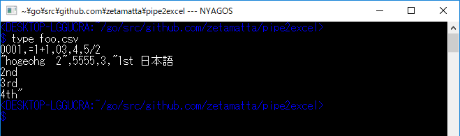

Pipe To Excel
=============

`pipe2excel.exe` sends the contents of STDIN 
or files of arguments to Excel as CSV to Microsoft Excel.

- The each value of the csv is inserted as a string.
    - Only matching `/^[1-9]\d*(\.\d*[1-9])?$/`, as a number
- The encoding of the CSV is detected automatically whether it is written in UTF8 or the encoding of the current codepage.

```
C:\> pipe2excel foo.csv bar.csv
```

```
C:\> type foo.csv | pipe2excel
```




history
-------
- 0.2
    - Only matching `/^[1-9]\d*(\.\d*[1-9])?$/`, as a number
- 0.1
    - Set cell as a string
    - Detect encoding utf8 or codepage automatically and remove -u option
    - Add -v option to show version
- 20180701
    - prototype
